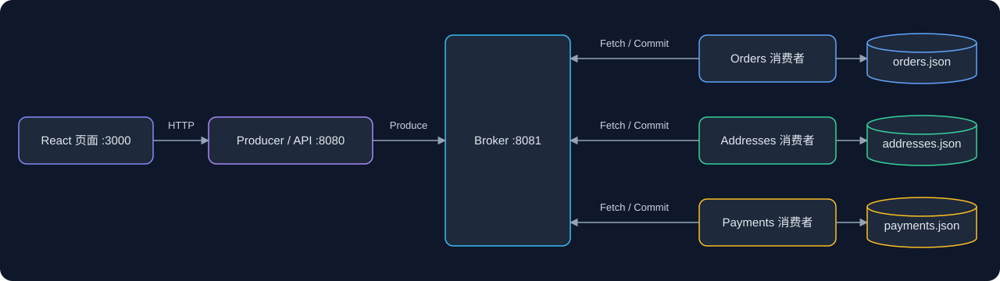

# Kafka Sim

用 **Go + React + TypeScript** 实现的 Kafka 概念模拟与可视化项目。通过订单、地址和支付三类消息，观察消息从生产、分区存储到消费、提交 Offset 的完整过程。

适合学习 Topic、Partition、Offset 和拉取消费模型。无需安装 Kafka、Java 或 ZooKeeper；项目使用自定义 HTTP/JSON 接口，不兼容 Kafka 原生客户端，也不具备生产级消息可靠性。

## 功能

- **消息生产**：通过页面或 HTTP API 生成随机业务消息，查看发送结果。
- **分区日志**：默认三个 Topic，每个三个 Partition，分区内追加消息并分配递增 Offset。
- **拉取消费**：三个消费者服务各自监听一个 Topic，按分区拉取并提交下一条待消费的位置。
- **消费落盘**：将已消费消息保存为本地 JSON 文件。
- **实时展示**：通过 WebSocket 展示消息和进度变化，提供架构图、分区消息列表、积压及消费速率指标。
- **本地运行脚本**：编译、启动和停止服务，支持清理演示数据。

## 架构



Broker 内部的消息日志和消费进度保存在内存中。每个消费者服务启动三个 goroutine，分别固定监听 P0、P1、P2，每两秒拉取一次，每次每分区最多 100 条。

消费者的九个 HTTP 端口用于查询状态和消息，实际对应三个服务进程，并非九个独立消费者进程。

| 服务 | Topic / Group | 端口 |
| --- | --- | --- |
| 前端 | — | 3000 |
| Producer / Backend API | — | 8080 |
| Broker | 默认 orders、addresses、payments | 8081 |
| Orders 消费者 | orders / orders-group | 8082 / 8083 / 8084 |
| Addresses 消费者 | addresses / addresses-group | 8085 / 8086 / 8087 |
| Payments 消费者 | payments / payments-group | 8088 / 8089 / 8090 |

## 快速开始

### 环境要求

- Go 1.22 或更高版本。
- Node.js 22.12+ 与 npm（当前前端使用 Vite 8）。
- 一键脚本需要 Bash、`lsof` 和类 Unix 环境；Windows 可使用 WSL。

以下命令均在包含本文件和 `go.mod` 的 **kafka-sim 项目目录**执行。如果克隆的是外层 Go 学习仓库，请先进入其中的 `kafka-sim/`。

### 一键启动

> 当前启动脚本会强制结束占用 3000、8080–8090 端口的进程，停止脚本也会按端口清理。运行前请确认这些端口没有其他需要保留的服务；有冲突时可使用下面的手动启动方式。

```bash
bash scripts/start.sh
```

脚本编译 Go 服务，并在缺少 `node_modules` 时自动执行 `npm install`。启动后访问 [http://localhost:3000](http://localhost:3000)。

1. 在页面发起一批随机消息。
2. 观察各 Topic / Partition 的消息和 Offset。
3. 等待消费者轮询，观察提交进度和积压变化。
4. 查看消费速率，以及 `data/` 中保存的消费结果。

运行日志与 PID 文件位于 `/tmp/kafka-sim-pids/`。

```bash
# 停止服务，同时移除临时二进制、PID 和运行日志
bash scripts/stop.sh

# 可选：停止服务后删除三类已消费消息的 JSON 文件
bash scripts/clean-data.sh
```

清理脚本会删除消费结果。Broker 重启也会清空内存中的消息与 Offset，但不会自动删除已有 JSON 文件。

### 手动启动

分别在五个终端中，从项目目录运行：

```bash
# 终端 1：Broker
go run ./broker/

# 终端 2：Orders 消费者
go run ./consumers/orders/

# 终端 3：Addresses 消费者
go run ./consumers/addresses/

# 终端 4：Payments 消费者
go run ./consumers/payments/

# 终端 5：Producer / API
go run ./producer/
```

在第六个终端启动前端：

```bash
cd frontend
npm ci
npm run dev
```

消费者支持 `--broker`、`--group-id`、`--db-dir` 和 `--port-p0/p1/p2` 参数；可通过 `go run ./consumers/orders/ --help` 查看。若修改服务端口，需要同步调整前端代理与后端服务地址配置。

## API 示例

### 批量模拟

```bash
curl -X POST http://localhost:8080/send/batch \
  -H 'Content-Type: application/json' \
  -d '{"count": 100}'
```

`count` 表示随机模拟的迭代次数，**不等于最终消息条数**：一次迭代可能向多个 Topic 发送消息。当前批量实现为逐条同步 HTTP 发送，不是 Kafka 的网络批处理。

### 向指定分区写入消息

```bash
curl -X POST http://localhost:8081/produce \
  -H 'Content-Type: application/json' \
  -d '{"topic":"orders","partition":0,"key":"order-1","value":"hello kafka-sim"}'
```

### 从指定 Offset 拉取

```bash
curl -X POST http://localhost:8081/fetch \
  -H 'Content-Type: application/json' \
  -d '{"topic":"orders","partition":0,"offset":0,"maxBytes":10}'
```

这里的 `maxBytes` 实际按**消息条数**限制，名称沿用了 Kafka 概念。直接调用 Fetch 不会自动提交进度，也不会删除消息。

### 查询消费状态

```bash
curl http://localhost:8082/status
curl http://localhost:8082/messages
curl http://localhost:8082/metrics
```

| 组件 | 接口 | 用途 |
| --- | --- | --- |
| Broker | `POST /produce` | 写入消息 |
| Broker | `POST /fetch` | 按分区和 Offset 拉取 |
| Broker | `POST /offset/commit` | 提交组的消费进度 |
| Broker | `POST /offset/fetch` | 查询已提交进度 |
| Broker | `GET /topics` | Topic 和分区信息 |
| Broker | `WS /ws` | 状态快照与实时事件 |
| Producer / API | `POST /send/batch` | 随机模拟 |
| Producer / API | `GET /topics`、`GET /services` | Topic 与消费者服务信息 |
| Producer / API | `GET /consumer/metrics` | 聚合消费者指标 |
| Consumer | `GET /status`、`GET /messages` | 当前分区状态和本次进程消费的消息 |
| Consumer | `GET /metrics` | 所属服务的聚合指标 |

## 与 Apache Kafka 的区别

| 方面 | 本项目 | Apache Kafka |
| --- | --- | --- |
| 存储 | Broker 内存日志；消费结果写 JSON | 持久化分区日志，支持保留和压缩策略 |
| Offset | 内存 Map | 消费组进度存入内部 Topic |
| 集群 | 单 Broker | 多 Broker、分区副本与故障切换 |
| 消费组 | Group ID 区分进度，手动固定分区 | 成员协调、分区分配与再均衡 |
| 协议 | HTTP + JSON | Kafka 原生二进制协议 |
| 生产 | 同步逐条发送，模拟器随机选择分区 | 批处理、压缩、可配置分区及确认策略 |
| 可靠性 | 无幂等生产、事务或副本确认 | 提供相应机制，保证取决于配置及使用方式 |

概念参考：[Apache Kafka 官方设计文档](https://kafka.apache.org/41/design/design/)。

### 当前限制

- **重启恢复**：Broker 重启后消息和提交进度丢失；消费者 JSON 不是 Broker 日志的备份。
- **失败处理**：消费结果写入失败后仍会尝试提交 Offset，可能跳过未保存的数据；写入成功而提交失败时可能重复消费，存储层没有去重。
- **消费组协调**：同组多个实例不会自动分担分区，可能重复消费并覆盖进度。
- **指标语义**：`HighWatermark` 实际表示日志末尾位置，没有模拟副本提交边界；`pending` 使用各组最大提交位置，不能表示每个组各自的积压。
- **性能与容量**：消息常驻内存，没有保留策略；JSON 文件每批全量重写，历史数据越多，写入成本越高。页面速率指标用于演示，不代表 Kafka 性能。
- **接口与部署**：未实现认证、授权和完善的输入校验，面向本地学习环境。前端依赖 Vite 开发代理，构建静态文件后仍需另外配置 API / WebSocket 反向代理。

## 目录结构

```text
kafka-sim/
├── broker/                 # Broker 入口
├── common/                 # 消息及 API 数据结构
├── consumers/              # orders、addresses、payments 服务入口
├── database/               # 消费结果 JSON 存储
├── frontend/               # React + TypeScript 页面及 Vite 代理
├── kafka/
│   ├── broker/             # Topic、Partition、Offset、WebSocket
│   ├── consumer/           # 分区监听器和消费者服务
│   └── producer/           # HTTP 生产者库
├── producer/               # 随机模拟及 Backend API 入口
├── scripts/                # 启动、停止、清理脚本
├── data/                   # 运行时生成的消费数据（不提交）
├── go.mod
└── go.sum
```

## 开发检查

```bash
# 在此 Go 模块内执行；目前尚无自动化测试用例
go test ./...

# 前端静态检查与构建
cd frontend
npm run lint
npm run build
```

本目录是独立 Go 模块，在外层仓库执行 `go test ./...` 不会覆盖本模块。

## 后续方向

- [ ] 修复存储失败仍提交 Offset 的处理逻辑。
- [ ] 添加 Broker 日志与消费进度持久化。
- [ ] 添加消费去重、异常重试和故障恢复测试。
- [ ] 按消费组展示独立积压。
- [ ] 模拟消费者成员管理、分区分配和再均衡。
- [ ] 逐步实现批处理、日志分段与保留策略。
- [ ] 探索副本复制与 Leader 切换。
